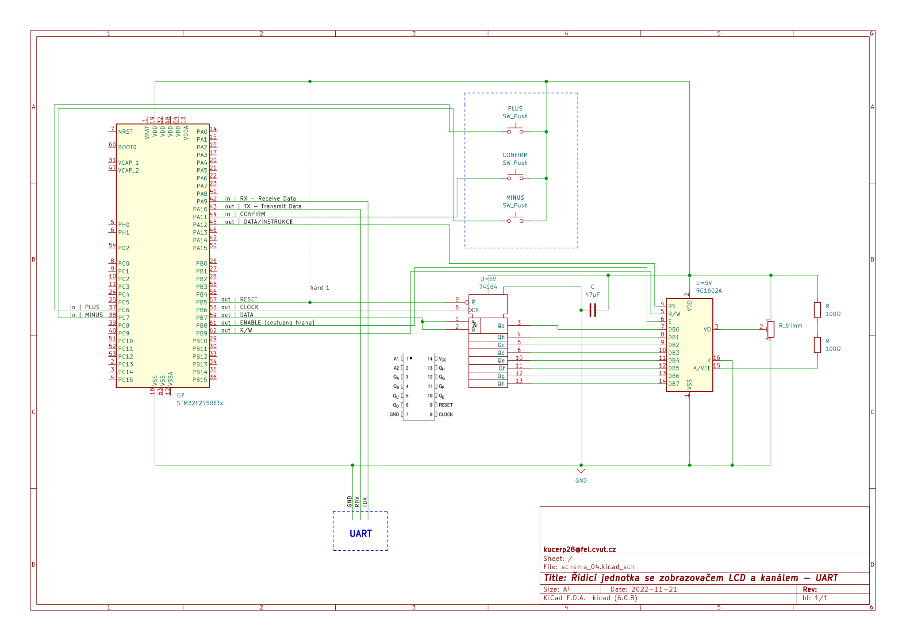
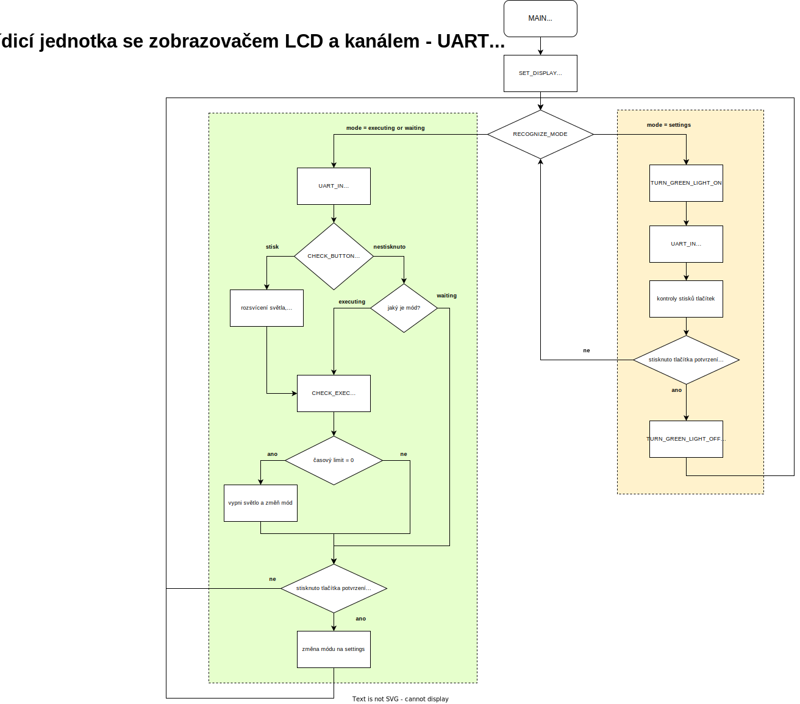

# Řídicí jednotka se zobrazovačem LCD a kanálem - UART

## Úkol

Cílem tohoto projektu bylo navhrnout a realizovat sestavení prototupu řídící jednotky kladoucí si za cíl:
- ovládat světla,
- zobrazovat konfiguraci na semigrafickém zobrazovači ovládným řadičem ***HD44780***,
- konfiguraci pomocí 3 řídicích tlačítek
- a konfiguraci a zobrazování konfigurace pomocé *sérioévho komunikačního kanálu* navázaného na interní obvod *UART* v *STM32F100*.

## Návrh shématu

*Mikrontroler v schématu není STM32F100, nýbrž jemu podobný se stejnými jinak rozmísěnými piny.*

Pdf verze: [schema_04.pdf](https://github.com/petrkucerak/NVS/blob/main/classes/04_homework/schema/schema_04/schema_04.pdf)

## Průběh programu

Průběh programu detailně popisuje následující vývojový diagram.

Png verze: [vyvojovy-diagram.png](https://github.com/petrkucerak/NVS/blob/main/classes/04_homework/vyvojovy-diagram.png)