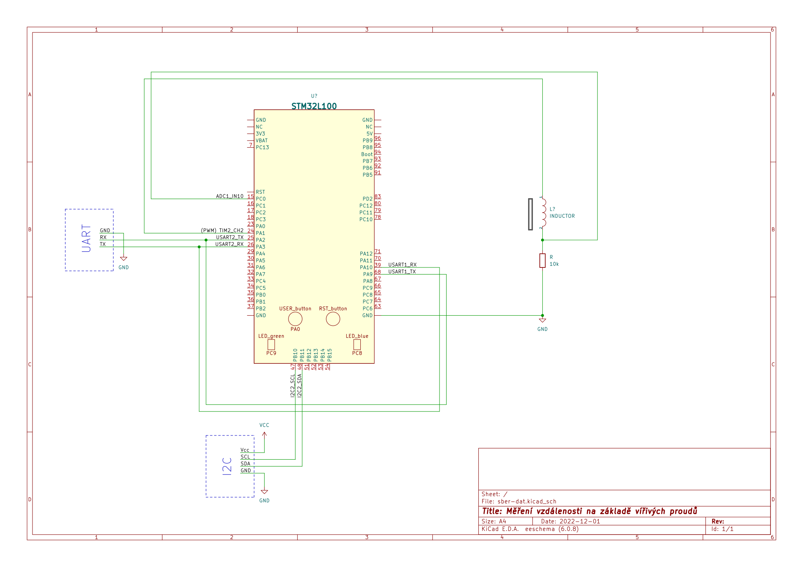

# Měření vzdálenosti na základě vířivých proudů a filtrování pomocí Lock-In detekce

## Cíl projektu

Cílem tohoto projektu je se pokusit změřit vzdálenost mezi cívkou a kovovým předmětem, naměřená data filtrovat pomocí lock-in detekce a hodnoty zobrazovat na displaji propojeném I2C nebo SPI sběrnicí (typ dle dostupnosti). Mikrokontrolér půjde konfigurovat pomocí rozhraní UART.

## Dílčí úkoly projektu

- generovat obdélníkové napětí pomocí PWA ve 4 frekvencích, které budou konfigurovatelné přes UART (10kHz, 25kHz, 50kHz, ...?)
- změřit vzdálenost pomocí vířivých proudů pomocí cívky, analyzovat pomocí A/D převodníku a zesílit pomocí operačního zesilovače
- implementovat filtrování pomocí lock-in softwarového zesilovače
- odeslat data pomocí I2C nebo SPI sběrnice do displaje
- odesílat data do UART a umožnit konfigurovat data

## Schéma zapojení

