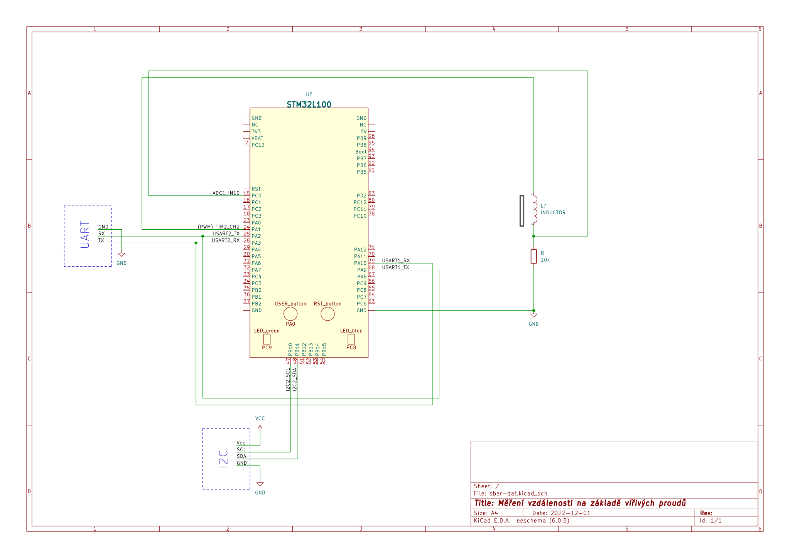
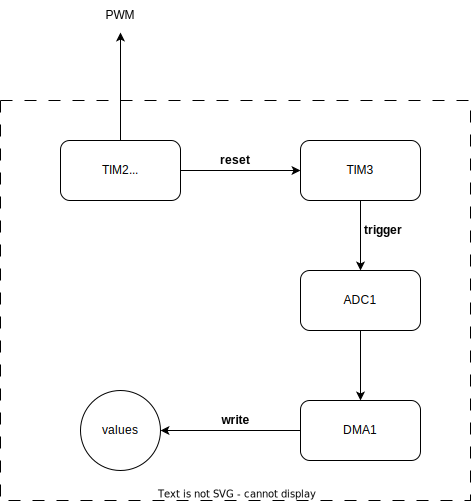

# Report: Měření vzdálenosti na základě vířivých proudů

## Specifikace

### Cíl projektu

Cílem tohoto projektu je se pokusit změřit vzdálenost mezi cívkou a kovovým předmětem, naměřená data filtrovat pomocí lock-in detekce a hodnoty zobrazovat na displaji propojeném I2C nebo SPI sběrnicí (typ dle dostupnosti). Mikrokontrolér půjde konfigurovat pomocí rozhraní UART.

### Dílčí úkoly projektu

- generovat obdélníkové napětí pomocí PWA ve 4 frekvencích, které budou konfigurovatelné přes UART (10kHz, 25kHz, 50kHz, ...?)
- změřit vzdálenost pomocí vířivých proudů pomocí cívky, analyzovat pomocí A/D převodníku a zesílit pomocí operačního zesilovače
- implementovat filtrování pomocí lock-in softwarového zesilovače
- odeslat data pomocí I2C nebo SPI sběrnice do displaje
- odesílat data do UART a umožnit konfigurovat data

## Postup při řešení

Veškerá práce na projektu je dokumentována v [repozitáři na GitHubu](https://github.com/petrkucerak/NVS/tree/main/classes/05_sber-dat).

### Schéma zapojení

Pro řešení mého projektu jsem navrhnul tento obvod. Nejedná se o první verzi. Prováděl jsme určité změny na základě konzultace s cvičícím a otestování vlastností cívky. Konkrétně nepoužití zesilovače a využití pouze jednoho 10 kΩ odporu.

### Konfigurace perierií

#### UART

Slouží k odesílání dat mezi PC a MC.

- PA2 (USART2_TX)
- PA3 (USART2_RX)
- GND

#### I2C

Slouží k vykreslování naměřených dat.

- PB10 (I2C2_SCL)
- PB11 (I2C2_SDA)
- Vcc (5V)
- GND

#### TIM2 (PWM), ADC1, TIM3, DMA1

- **TIM2** generuje PWM o frekvecni *f*. Generovaný signál vystupuje na pinu *PA1*. Zároveň se *TIM2* v módu *master* synchronizuje s *TIM3*.
- **TIM3** beží na vyšší frekvenci *f* než *TIM2*. *TIM3* je synchronizován s *TIM2*. Dálé tento časovač spouští *ADC1*. Slouží k vzorkování dat.
- **ADC1** slouží k převodu analogových dat do digitální podoby z cívky.
- **DMA1**  přeposílá data z ADC1 data registru do pole určeného pro naměřené hodnoty.

*Celý průběh je vizualizován v diagramu (viz níže).*

### Součaný stav projektu

V projektu funguje:

1. UART komunikace
2. generování PWM
3. čtení pomocí ADC1, který je trigrován TIM3 a přenos dat pomocí DMA
4. synchronizace TIM2 a TIM3

V projektu nefunguje:

1. I2C komunikace (pravděpodobně špatná konfigurace periferií; po odeslání START bitu, se nenastaví informace do status registru)
2. lock-in detekce (není doprogramováno)

## Reference

- OLED I2C Display dokumentace: https://cdn-shop.adafruit.com/datasheets/SSD1306.pdf
- [CD00251732___STM32F100RB.pdf](assets/CD00251732___STM32F100RB.pdf)
- [RM0041_reference_manual_ARMSTM32F100xx.pdf](assets/RM0041_reference_manual_ARMSTM32F100xx.pdf)